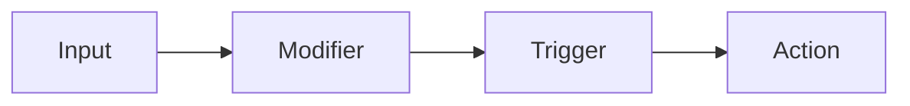
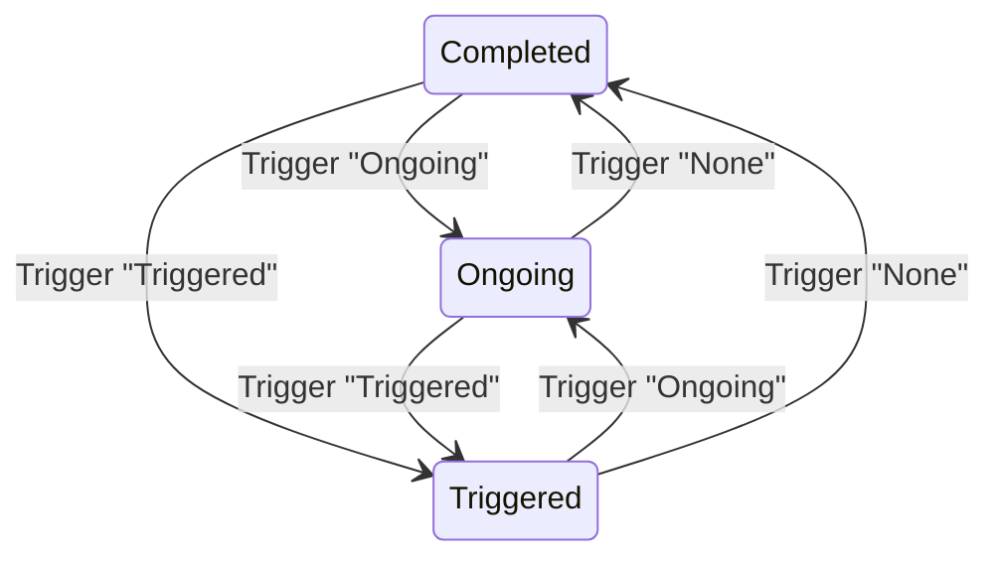
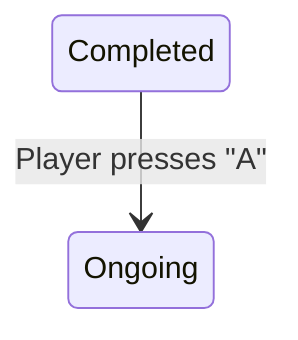
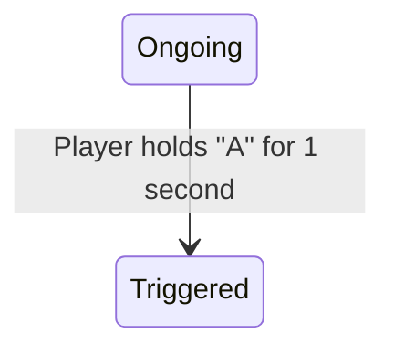
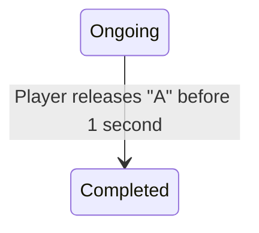
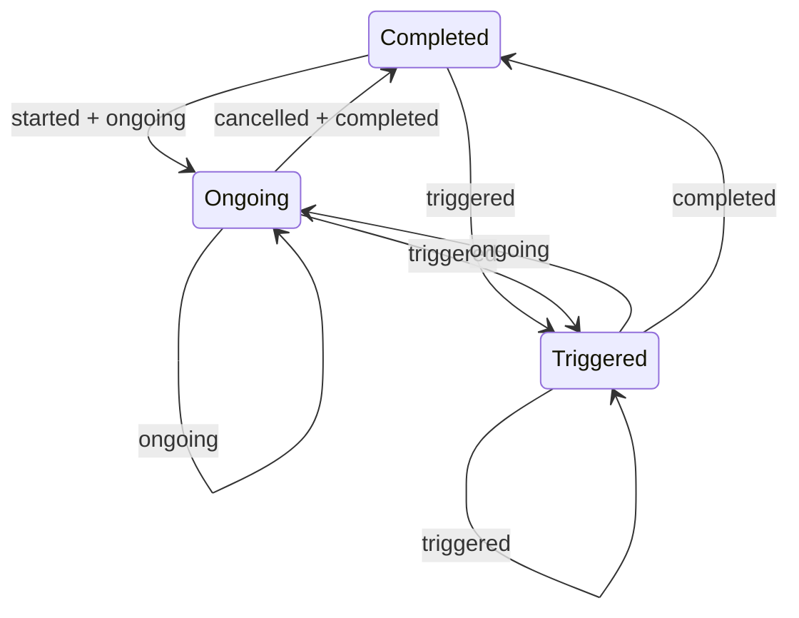

## Introduction

G.U.I.D.E is a plugin for Godot that allows you to create input actions and bind them to input events. It is designed to
be easy to use and flexible enough to cover a wide range of use cases. This document will give you a high level overview
of how G.U.I.D.E works.

The general idea is that we have input actions that are bound to input events. This is very similar to how the input
system in Godot works, but with some key differences. The main difference is that G.U.I.D.E uses not just a simple "this
input is this action" mapping. Instead, G.U.I.D.E provides a fully configurable input pipeline that receives input,
processes it and then analyzes the input to determine which actions should be triggered. At a high level, this pipeline
looks like this:

1. First, G.U.I.D.E receives input from Godot's input system.
2. Then modifiers can be applied to this input (e.g. invert the input, scale it, apply a deadzone,etc.).
3. Now the input is passed to a trigger. The trigger decides whether the input should trigger the action. There are
   different triggers available, e.g. triggering on hold, press, tap, etc.
4. If the trigger decides that the input should trigger the action, the action is triggered.

G.U.I.D.E borrows this system from Unreal Engine's Enhanced Input System, but with some modifications to make it work
nicely with Godot. So if you are familiar with Unreal Engine's enhanced input system, you will feel right at home with
G.U.I.D.E.

## Input
An input is piece of input data acquired from an input device. This is really just raw data and doesn't have any meaning by itself. All input is represented as a `Vector3` in G.U.I.D.E. Depending on the input device not all components of the `Vector3` will be used. For example keys and button presses will only use the `x` component, while analog sticks will use `x` and `y`. Specific input devices (like the accelerometer or XR controllers) might use all three components. G.U.I.D.E has support for most common input devices and will automatically handle the input data correctly.

- **Keyboard** / **Mouse Buttons** / **Controller Buttons** - `x` is 1 if the key is pressed, 0 otherwise.
- **Mouse relative movement** - `x` and `y` are the relative movement of the mouse.
- **Analog sticks** - `x` and `y` are the position of the stick.

## Modifiers

A _modifier_ is a component that can modify the input before it is passed to the trigger. It takes the `Vector3` from the input and returns a modified `Vector3`. There are a variety of modifiers built into G.U.I.D.E, such as:

- **Deadzone** - Removes input values that are below a certain threshold and remaps the remaining values to the range [0, 1].
- **Invert** - Inverts the input values.
- **Scale** - Scales the input values by a certain factor.

## Triggers

A _trigger_ is a component that decides whether an action should be triggered by input. There are a variety of triggers built into G.U.I.D.E, such as:

- **Down** - Triggers every frame while the input is held down.
- **Hold** - Triggers after the input has been held down for a certain amount of time.
- **Press** - Triggers once when the input is pressed.
- **Pulse** - Triggers repeatedly with a certain interval while the input is held down.
- **Tap** - Triggers when the input is pressed and released quickly.

## Actions

An _action_ is a named input event that can be triggered by input. An action has both a state and a value. The value of an action is the combination of all input values that are assigned to the action. This value can be used to determine the strength of the input (similar to Godot's built-in `get_action_strength`function).

### Action states

Actions can be in one of three states:

- **Completed** - The action is currently not active at all.
- **Ongoing** - The triggers assigned to the action have detected input that can potentially trigger the action but not
  all requirements have yet been satisfied.
- **Triggered** - The action is currently active has been triggered by input.

### Action state changes

The action's state is changed by the triggers that are assigned to this action in the mapping context. The trigger will
look at the input assigned to the action and then react to it. This reaction drives the action's state. Triggers have
the following reactions:

- **None** - The trigger is not affected by the input.
- **Ongoing** - The trigger is potentially affected by the input but is not yet triggered.
- **Triggered** - The trigger is triggered by the input.

The combination of the action's state and the trigger's reaction to the input determines the action's state. The
following diagram shows how the action's state changes based on the trigger's reaction to the input:

Let's look at an example to make this clearer. Lets say we have an _Interact_ action and we want this action to trigger
when the player holds the controller's _A_ button down for 1 second.

At the beginning, the _Interact_ action is in the _Completed_ state. Now the player presses the _A_ button. The trigger
assigned to the _Interact_ action will detect this input and react with _Ongoing_. This will in turn change the
_Interact_ action's state to _Ongoing_.

The player continues to hold the _A_ button. After 1 second, the trigger will react with _Triggered_. This will change
the _Interact_ action's state to _Triggered_.

In instead the player would have released the _A_ button before the 1 second have passed, the trigger would have reacted
with _None_ and the _Interact_ action would have returned to the _Completed_ state.

### Action signals

Actions can emit signals when they change their state. This allows you to react to the action's state changes in your
code. Events are emitted as Godot signals, so they can be connected to your code in the same way as other signals. The
following table shows the events that actions can emit:

| Current State | New State | Signal      | Remarks                                            |
|---------------|-----------|-------------|----------------------------------------------------|
| Completed     | Ongoing   | `started`   | Only emitted for 1 frame.                          |
| Completed     | Ongoing   | `ongoing`   |                                                    | 
| Completed     | Triggered | `triggered` |                                                    |
| Ongoing       | Ongoing   | `ongoing`   | Emitted every frame while action is ongoing.       |
| Ongoing       | Triggered | `triggered` |                                                    |
| Ongoing       | Completed | `cancelled` | Only emitted for 1 frame.                          |
| Ongoing       | Completed | `completed` |                                                    |
| Triggered     | Ongoing   | `ongoing`   |                                                    |
| Triggered     | Completed | `completed` |                                                    |
| Triggered     | Triggered | `triggered` | Emitted every frame while the action is triggered. |

The following diagram shows the possible state transitions and the signals that are emitted:

