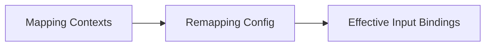

## Introduction

A very common use case in games is to allow players to remap their controls. G.U.I.D.E provides a built-in system to allow players to remap their controls at runtime with very little effort.

## How remapping works

When our game starts, we load a set of mapping contexts into G.U.I.D.E. These mapping contexts have the default input bindings for all actions, as we have defined them when creating the game. When we allow the player to remap inputs, we create a `GUIDERemappingConfig` - a resource that stores input bindings that the player has chosen. We can then feed this `GUIDERemappingConfig` into the `GUIDE` singleton to apply the changed input bindings on top of the currently active mapping contexts.



So the code for applying a remapping config could look somewhat like this:

```gdscript
## Path where the remapping config is saved. This file may
## not exist if the player has not remapped their controls yet.
const REMAPPING_CONFIG_PATH:String = "user://remapping_config.tres"

func _ready():
    # Load the remapping config if it was previously saved.
    if ResourceLoader.exists(REMAPPING_CONFIG_PATH):
        var remapping_config:GUIDERemappingConfig = load(REMAPPING_CONFIG_PATH)
        GUIDE.set_remapping_config(remapping_config)

    # Add or change the mapping contexts as needed.
    GUIDE.enable_mapping_context(some_mapping_context)
```

Note, that the remapping config will remain active until we set a new one. So we can enable and disable mapping contexts as needed and the remapping will still be applied on top of the currently active mapping contexts.

## Marking actions for remapping

By default, G.U.I.D.E actions cannot be remapped. This is because only the developer can know which actions are suitable for remapping and it usually is not desirable to have every `GUIDEAction` to be remappable. We can mark actions for remapping in the inspector:


In there, we have three settings:

- **Is Remappable**: If this is enabled, the action can be remapped.
- **Display Name**: This is a human-readable name for the action which we can later show in our remapping dialog.
- **Display Category**: This is a category for the action which we can later show in our remapping dialog.

Using a _Display Name_ and _Display Category_ is optional, but it will help us implement the remapping dialog later.

### Actions with multiple inputs

Some actions may have more than one input assigned to them, for example when using WASD for creating a 2D movement action. In this case, we have the possibility to override the _Display Name_ and _Display Category_ for each input that is assigned to the action:


To do this, we press the settings icon on the left hand side of the input mapping (#`1` in the image above). This will open the input mapping in the inspector. Now we can check the _Override action settings_ checkbox (#`2`). Now we can set the _Display Name_ and _Display Category_ for this specific input mapping (#`3`). If we leave a field empty, the value from the action will be used. We can also uncheck the _Is Remappable_ checkbox to disable remapping for this specific input mapping if needed.


## Creating a remapping dialog

When the game first starts, we don't have a remapping config yet and the game will use the default controls that the developer set up in the design phase. So we need to create a dialog that allows the player to remap their controls. This dialog should show all actions that are marked as remappable and allow the player to assign new inputs to them. When the dialog is closed, it should produce a `GUIDERemappingConfig` that can be saved to disk. 

Because the remapping dialog is very game-specific, G.U.I.D.E does not provide a built-in dialog for this. You will have to create your own dialog that fits the style of your game. However, G.U.I.D.E provides a few helpers to make this easier.

The first helper is the `GUIDERemapper` class, which provides a convenient interface to get all remappable actions and their current input bindings, apply new input bindings, check the input mappings for conflicts and produce a `GUIDERemappingConfig` from the current input bindings.

Let's first create an instance of `GUIDERemapper`:

```gdscript
var _remapper:GUIDERemapper = GUIDERemapper.new()

# The remapper needs to be initialized with _all_ mapping contexts that our 
# game uses which contain remappable actions. We can load these in any way
# either with `load` or using an @export var in our dialog scene.

@export var mapping_contexts:Array = []

# We also need the current remapping config to initialize the remapper, so
# the remapper knows which inputs have already custom bindings.

var remapping_config:GUIDERemappingConfig = load(REMAPPING_CONFIG_PATH)

func _ready():
    _remapper.initialize(mapping_contexts, remapping_config)
```

Now we have a functional remapper that knows about all remappable actions and their current input bindings. We can now use this remapper to create a dialog that allows the player to remap their controls.

### Getting remappable items

To get all remappable items, we can use the `get_remappable_items` method:

```gdscript
var remappable_items:Array[GUIDERemapper.ConfigItem] = _remapper.get_remappable_items()
```

This will return an array of `GUIDERemapper.ConfigItem` objects. Each of these config items represents one action or input mapping that can be remapped. The `ConfigItem` has the following properties which we can use to display the items in our dialog:

- `mapping_context` - The mapping context from which the action or input mapping comes.
- `action` - The action to which the input mapping belongs. 
- `index` - The index of the input mapping in the action. This is useful if the action has multiple input mappings.
- `display_category` - The display category of the action or input mapping. This automatically handles overrides from the input mapping.
- `display_name` - The display name of the action or input mapping. This automatically handles overrides from the input mapping.
- `value_type` - the value type of the input (e.g. `BOOL`, `AXIS_1D`, `AXIS_2D`, etc.). This is useful later when detecting the input, to limit input to the correct type.
- `is_remappable` - Whether the action or input mapping is remappable. If we got the item from `get_remappable_items`, this will always be `true`, but later when we check for conflicts, this might be `false`. 

#### Filtering remappable items

You may want to filter the remappable items to only show certain categories or only items for a specific action or mapping context. The `get_remappable_items` method has three optional parameters that provide predefined filters:

```gdscript
# Filter all items in the keyboard mapping context.
var items := _remapper.get_remappable_items(keyboard_mapping_context)

# Filter all items in the "Movement" category.
var items := _remapper.get_remappable_items(null, "Movement")

# Filter all items for the "Move" action.
var items := _remapper.get_remappable_items(null, null, move_action)

# We can of course also use a completely custom filter by iterating over all items
# and filtering them ourselves using the array filter method or a simple for loop.
var items := _remapper.get_remappable_items() \
    .filter(func(item): return item.display_category == "Movement")

```

Now with these remappable items, we can create a user interface which shows all the items that can be remapped and allows the user to re-bind them. 

### Getting the currently bound input for an item

When we create the this interface, we need to show the current input that is bound to an action. We can get this information from the remapper:

```gdscript
var current_input:GUIDEInput = _remapper.get_bound_input_or_null(item)
```

This will return the current input that is bound to the action or input mapping. If no input is bound (because the player has deliberately unbound this input), it will return `null`.

Now we have a `GUIDEInput` object, but we need to format this in a way the player can understand. We can use the `GUIDEInputFormatter` class that we also use for [displaying input prompts]({{site.baseurl}}/usage/input-prompts) in our game. Like with the input prompts, we can either use a plain text representation or an icon representation. 

```gdscript
# Get the formatter for the input. The 48 is the size of the icon we want to use.
# If we only want to use text, we can leave this out.
var formatter:GUIDEInputFormatter = GUIDEInputFormatter.new(48)

# Get the formatted input in text form
var input_text:String = formatter.input_as_text(current_input)

# Get the formatted input as an icon. This will return a bbcode string 
# that we can use in a RichTextLabel.
var input_as_icon:String = await formatter.input_as_richtext_async(current_input)
``` 

Note, that because the icon is generated on the fly, this may take a few frames to complete. So we need to use `await` to wait for the icon to be generated.

So a very simple way to build the interface could look like this:

```gdscript
# get a formatter
var _formatter:GUIDEInputFormatter = GUIDEInputFormatter.new(48)

func _build_interface():
    # get all items
    var items:Array[GUIDERemapper.ConfigItem] = _remapper.get_remappable_items()
    
    # We now use a GridContainer to display the items in a grid.
    var grid:GridContainer = $GridContainer
    
    for item in items:
        var current_input:GUIDEInput = _remapper.get_bound_input_or_null(item)
    
        # add a rich text label to the grid which shows the bound input as an icon
        var label:RichTextLabel = RichTextLabel.new()
        grid.add_child(label)

        # apply the formatted input as an icon to the label
        _apply_input(current_input, label)
        
        # the item's bound input can change at any time and we
        # don't want to re-build this interface every time, so we
        # subscribe to the item's input changed signal to update the
        # label when the input changes.
        item.changed.connect(_apply_input.bind(label))
        
        # add the display name as a label to the grid
        var name_label:Label = Label.new()
        name_label.text = item.display_name
        grid.add_child(name_label)

# This function applies the input to a label. If the input is null, it will
# show a grayed out "Not bound" text.
func _apply_input(input:GUIDEInput, label:RichTextLabel):
    if input == null:
        label.parse_bbcode("[color=gray]Not bound[/color]")
        return
        
    var icon:String = await _formatter.input_as_richtext_async(input)
    label.parse_bbcode(icon)
```

In a real game this will likely be a bit more sophisticated, but this example should just show the general idea. You can find a slightly larger example of a remapping dialog that works for mixed keyboard/controller inputs in the `remapping` example that ships with G.U.I.D.E.

### Detecting input

Now that we have the current input configuration on screen, the player should be able to re-bind the input. For this, we somehow need to detect the input that the player wants to bind. To help with this, G.U.I.D.E provides the `GUIDEInputDetector` node. This node can be added to our dialog scene and will detect input from supported devices. We can add this node anywhere in our remapping dialog, as it isn't visible to the player.

The `GUIDEInputDetector` node has a few settings that we can use to configure it:


- **Detection Countdown Seconds** - an amount of seconds the detector will wait before it starts detecting input. This is useful to give the player a moment to prepare before they start pressing buttons.
- **Minimum Axis Amplitude** - the minimum amplitude an axis must have to be considered as actuated. This is useful to prevent accidental actuations by drifting sticks.
- **Abort Detection On** - this is a list of `GUIDEInput` objects representing inputs that will abort the detection. This is useful if we want to allow the player to cancel the detection by pressing a specific button. In the example the player can cancel the detection by pressing the `ESC` key on the keyboard or the `Back` button on a controller.
- **Use Joy Index** - when a joystick/gamepad event is detected, this setting determines which joystick index should be reported. The default is `Any` which will result in a binding that works for any attached joystick/gamepad. We can also set this to `Detected` which will return a binding that exactly matches the joystick/gamepad which was detected. This is useful if we want to allow the player to bind inputs to a specific joystick (for example in local multiplayer modes where two players use two joysticks to control the game).

Now that we have the `GUIDEInputDetector` node in our scene, we can start detecting input. We can start the detection by calling the `detect` method:

```gdscript
@onready var input_detector:GUIDEInputDetector = %InputDetector

func _rebind(item:GUIDERemapper.ConfigItem):
    input_detector.detect(item.value_type)
```

We need to tell the input detector which value type we would like to detect (e.g. `BOOL`, `AXIS_1D`, `AXIS_2D`, etc.). This is important because our input mapping usually expects a specific input value type, because we have modifiers that work on this value type. We can use the value type we get from the `ConfigItem` that we acquired from the remapper. After we called `detect`, the input detector will start the detection countdown and then wait for input. You may want to show a message to the player that they should press the button they want to bind.

#### Limiting input to device types

Depending on how our remapping dialog is set up, we may want to limit the input to specific device types. For example, if we have a dialog that has one page for keyboard and mouse and another page for gamepad, we may want to limit the input to the device type that is currently active. To limit the input to a specific device type, we can specify this in the `detect` method:

```gdscript
# Detect only keyboard and mouse input
input_detector.detect(item.value_type, \ 
    [GUIDEInputDetector.DeviceType.KEYBOARD, GUIDEInputDetector.DeviceType.MOUSE])
```

### Handling the detected input

When the input detector has detected an input, it will emit the `input_detected` signal. We can connect to this signal to handle the detected input. A very simple way to do this is to simply `await` the signal right after we started the detection:

```gdscript
func _rebind(item:GUIDERemapper.ConfigItem):
    input_detector.detect(item.value_type)

    var input:GUIDEInput = await input_detector.input_detected

    # The input variable now either contains the detected input
    # or is null if the detection was aborted.
```

Now we have the detected input and feed it back into the remapper to apply the new input binding:

```gdscript
func _rebind(item:GUIDERemapper.ConfigItem):
    ...
    if input != null:
        _remapper.set_bound_input(item, input)
```

### Checking for collisions

Setting the input binding like we just did is very simple, but it doesn't check for collisions. For example, if the player has already bound the `A` key to move left and now also binds the `A` key to jump, we have a collision or conflict. The game might still work, but now pressing `A` will trigger both actions. Also, the player might bind input that is reserved for other actions, like the `ESC` key which is usually used to open the pause menu.

To prevent this, we should check for collisions before we set the input binding:

```gdscript
func _rebind(item:GUIDERemapper.ConfigItem):
    ...
    # if the detection was aborted, there is no input to check for conflicts.
    if input == null:
        return
        
    # check for collisions. This will return an array of all items that
    # collide with the input we want to bind.
	var collisions:Array[GUIDERemapper.ConfigItem] = _remapper.get_input_collisions(item, input)
		
	# if any collision is from a non-remappable mapping, we cannot use this input
	# at all, so we abort the binding.
	if collisions.any(func(it:GUIDERemapper.ConfigItem): return not it.is_remappable):
		return
		
	# We resolve the collisions by unbinding the conflicting input.
	for collision in collisions:
		_remapper.set_bound_input(collision, null)
		
	# And finally we set the new input.
	_remapper.set_bound_input(item, input)        
```

This code does a very simple collision handling - it just unbinds any conflicting input, except if the conflicting input is not remappable (so the player cannot overwrite the non-remappable `ESC` binding for the menu). Depending on your game, you might want to handle collisions differently. For example, you could show a warning to the player that the input they are trying to bind is already used for another action and ask them if they want to overwrite the existing binding or cancel the binding. 

Also note that because we used the `ConfigItem`'s `changed` signal to update the interface when the input changes, the interface will automatically reflect the results of our collision resolution. So we don't need to do anything else to update the interface to reflect the new input bindings.

## Saving the remapping config

When the player has finished remapping their controls, we need to save the remapping config to disk. 

```gdscript
# Get the new remapping config from the remapper
var new_remapping_config:GUIDERemappingConfig = _remapper.get_remapping_config()

# Save the remapping config to disk
ResourceSaver.save(REMAPPING_CONFIG_PATH, new_remapping_config)

# Apply the new remapping config to the GUIDE singleton
GUIDE.set_remapping_config(new_remapping_config)
```

Because a remapping config is a resource, it is also possible to have multiple remapping configs and switch between them. So your remapping dialog could allow the player to save multiple remapping configs as input profiles and switch between them in the game settings.

